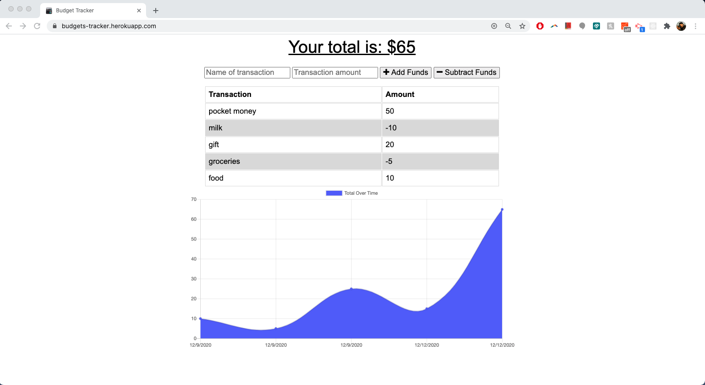
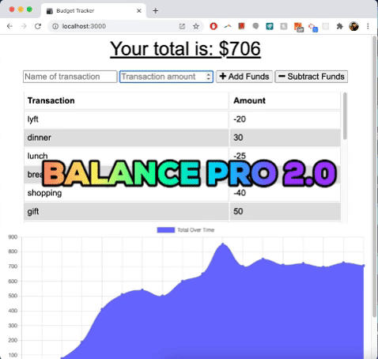
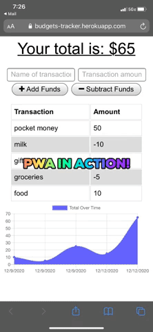
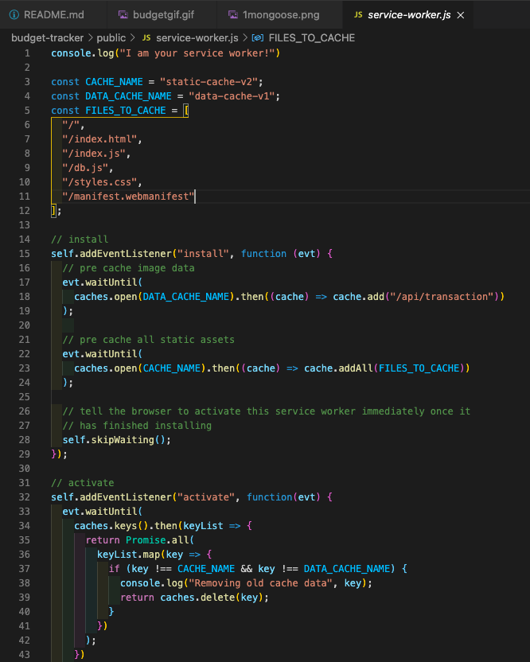
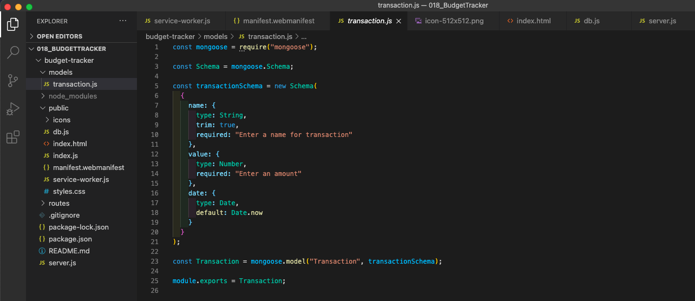

# 🤑 Balance Pro 2.0 :chart_with_upwards_trend:

## Description
__Balance Pro 2.0__ is a progressive web app (PWA) that gives frequent travelers and everyday commuters an opportunity to track their withdrawals and deposits with or without an Internet connection. Whether you are on a bus, in the tunnel or on a plane, now your finances remain easily accessible to you at anytime.

## Table of Contents
* [Installation](#Installation)
* [Usage](#Usage)
* [Tech_Stack!](#Tech_Stack!)
* [License](#License)
* [Contributing](#Contributing)
* [Test](#Test)
* [Questions](#Questions)

## Installation

1. You can use the app directly in the browser through the deployed Heroku link: https://budgets-tracker.herokuapp.com/
2. You can click the icon in the address bar to enjoy the functionalities of the app with a standalone app on your mobile device. 
3. You can download this repository to your computer and open the app with command __node server__ or __npm start__

## Usage
Your input fields are located on the top of the page. You can type the transaction name and amount. Click the " + Add Funds" button to add your funds or click the " - Subtract Funds" to withdraw money. The balance of your account will always be displayed on the chart below, whether you are online or offline. For a preview, see the screenshots below.

__App in the browser__

__App on iOS__

__As seen from the other side: cache in service-worker.js__

__As seen from the other side: Mongoose Transaction Schema__

## Tech_Stack!
This app utilizes the following technologies:
- JavaScript (82%)
- HTML (5%)
- CSS (5%)
- Express.js
- MongoDB & Mongoose

__Extra features that I implemented:__
1. IndexedDB for offline transactions
2. service-worker.js for caching
3. webmanifest for creating a PWA outside of the browser

## License
This application is covered under the MIT license.

## Contributing
If you would like to work on this project with me, reach out using the contact info below.

## Test
Testing framework used: coming soon!

## Questions
If you have additional questions, you can reach me via my GitHub profile: [Piotr72us](https://github.com/Piotr72us) 
or send me an email at: piotr72@gmail.com
